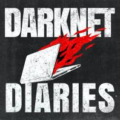
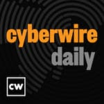

# Background
### Education

* Obtained an Associates of Applied Science in Information Technology from ITT Technical Institue

### Experience (Chronologically)

* General Dynamics Information Technology
    * Systems Administrator for two locations.
    * It was a general understanding that if the item had wires within it, I worked on it
* Lockheed Martin
    * I had the opportunity to work on fighter jets while living at the beach. Enough said
* SouthernLinc Wireless
    * Supported the implementation of the LTE project.
* Warren Averett
    * Supported assigned customers and cultivated those relationships.
    * Mentor junior colleagues 
* Blue Cross & Blue Shield of Alabama
    * Lead CyberArk Administrator along with automation of everything possible.
    * Educate other teams on automation tools and techniques utilizing CyberArk
    * Serve as a problem solver to devise solutions to problems within the organization

### Skills

* Virtualization Administration
* Linux Administration
* Windows Administration
* CyberArk Administration
* Network Administration
* Security Engineer
* Automation
* Networking with people

### A Story of Two Switches Not Connecting.

* Will they ever connect?
* What was wrong?
* What did I learn from this mistake?

### Two Servers on One Piece of Hardware

* How will the future look?
* Saved costs?
* Faster time to operation.
* Looking ahead what happened?

# Staying Current
### News

* [The Hacker News](https://thehackernews.com/ "The Hacker News")
* [Dark Reading](https://www.darkreading.com/ "Dark Reading")
* [Security Week](https://www.securityweek.com/ "Security Week")
* [Bleeping Computer](https://www.bleepingcomputer.com/ "Bleeping Computer")

### Podcasts

   

### Ongoing Learning

### Programming Languages
* PowerShell
* Python

## Learning Topics
* Currently trying out Kubernetes with [Linode](https://www.linode.com/?r=4dffecc5dd019bc812987b595ce20e6322efea2d "Linode")

- [x] Python
- [x] PowerShell
- [ ] Golang
- [x] Docker
- [ ] Kubernetes
